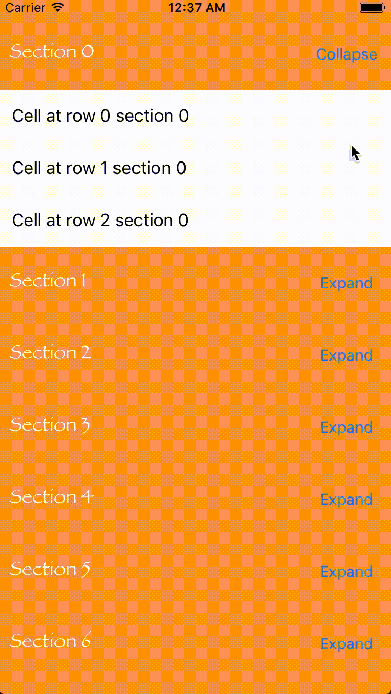

<p align="center" >
    
</p>

# LUExpandableTableView
A subclass of `UITableView` with expandable and collapsible sections

[](https://travis-ci.org/LaurentiuUngur/LUExpandableTableView)
[](http://cocoadocs.org/docsets/LUExpandableTableView/)
[](http://cocoadocs.org/docsets/LUExpandableTableView/)
[](https://opensource.org/licenses/MIT)

## Preview



## Installation

### CocoaPods

[CocoaPods](http://cocoapods.org) is a dependency manager for Cocoa projects. You can install it with the following command:

```bash
$ sudo gem install cocoapods
```

> CocoaPods 1.1.0+ is required.

To integrate LUExpandableTableView into your Xcode project using CocoaPods, specify it in your `Podfile`:

```ruby
source 'https://github.com/CocoaPods/Specs.git'
platform :ios, '9.0'
use_frameworks!

target '<Your Target Name>' do
    pod 'LUExpandableTableView'
end
```

Then, run the following command:

```bash
$ pod install
```
### Swift Package Manager

To integrate using Apple's [Swift Package Manager](https://swift.org/package-manager), add the following as a dependency to your `Package.swift`:

```Swift
.Package(url: "https://github.com/LaurentiuUngur/LUExpandableTableView", majorVersion: 2)
```

Here's an example of `PackageDescription`:

```Swift
import PackageDescription

let package = Package(name: "MyApp",
    dependencies: [
        .Package(url: "https://github.com/LaurentiuUngur/LUExpandableTableView", majorVersion: 2)
    ])
```

### Manually

If you prefer not to use either of the before mentioned dependency managers, you can integrate LUExpandableTableView into your project manually.

## Usage

* Import `LUExpandableTableView` into your project.

```Swift
import LUExpandableTableView
```

* Register a cell for an instance of `LUExpandableTableView`. Registered class must be a subclass of `UITableViewCell`. This step is not be necessary if you use storyboard.

```Swift
expandableTableView.register(MyTableViewCell.self, forCellReuseIdentifier: cellReuseIdentifier)
```

* Register a header for an instance of `LUExpandableTableView`. Registered class must be a subclass of `LUExpandableTableViewSectionHeader` Keep in mind that you cannot use storyboard in order to do this.

```Swift
expandableTableView.register(UINib(nibName: "MyExpandableTableViewSectionHeader", bundle: Bundle.main), forHeaderFooterViewReuseIdentifier: sectionHeaderReuseIdentifier)
```
* Set as data source and delegate.

```Swift
expandableTableView.expandableTableViewDataSource = self
expandableTableView.expandableTableViewDelegate = self
```

 * Implement `LUExpandableTableViewDataSource` and `LUExpandableTableViewDelegate` protocols.

 ````Swift
 // MARK: - LUExpandableTableViewDataSource

extension ViewController: LUExpandableTableViewDataSource {
    func numberOfSections(in expandableTableView: LUExpandableTableView) -> Int {
        return 42
    }
    
    func expandableTableView(_ expandableTableView: LUExpandableTableView, numberOfRowsInSection section: Int) -> Int {
        return 3
    }
    
    func expandableTableView(_ expandableTableView: LUExpandableTableView, cellForRowAt indexPath: IndexPath) -> UITableViewCell {
        guard let cell = expandableTableView.dequeueReusableCell(withIdentifier: cellReuseIdentifier) as? MyTableViewCell else {
            assertionFailure("Cell shouldn't be nil")
            return UITableViewCell()
        }
        
        cell.label.text = "Cell at row \(indexPath.row) section \(indexPath.section)"
        
        return cell
    }
    
    func expandableTableView(_ expandableTableView: LUExpandableTableView, sectionHeaderOfSection section: Int) -> LUExpandableTableViewSectionHeader {
        guard let sectionHeader = expandableTableView.dequeueReusableHeaderFooterView(withIdentifier: sectionHeaderReuseIdentifier) as? MyExpandableTableViewSectionHeader else {
            assertionFailure("Section header shouldn't be nil")
            return LUExpandableTableViewSectionHeader()
        }
        
        sectionHeader.label.text = "Section \(section)"
        
        return sectionHeader
    }
}

// MARK: - LUExpandableTableViewDelegate

extension ViewController: LUExpandableTableViewDelegate {
    func expandableTableView(_ expandableTableView: LUExpandableTableView, heightForRowAt indexPath: IndexPath) -> CGFloat {
        /// Returning `UITableViewAutomaticDimension` value on iOS 9 will cause reloading all cells due to an iOS 9 bug with automatic dimensions
        return 50
    }
    
    func expandableTableView(_ expandableTableView: LUExpandableTableView, heightForHeaderInSection section: Int) -> CGFloat {
        /// Returning `UITableViewAutomaticDimension` value on iOS 9 will cause reloading all cells due to an iOS 9 bug with automatic dimensions
        return 69
    }
    
    // MARK: - Optional
    
    func expandableTableView(_ expandableTableView: LUExpandableTableView, didSelectRowAt indexPath: IndexPath) {
        print("Did select cell at section \(indexPath.section) row \(indexPath.row)")
    }
    
    func expandableTableView(_ expandableTableView: LUExpandableTableView, didSelectSectionHeader sectionHeader: LUExpandableTableViewSectionHeader, atSection section: Int) {
        print("Did select cection header at section \(section)")
    }
    
    func expandableTableView(_ expandableTableView: LUExpandableTableView, willDisplay cell: UITableViewCell, forRowAt indexPath: IndexPath) {
        print("Will display cell at section \(indexPath.section) row \(indexPath.row)")
    }
    
    func expandableTableView(_ expandableTableView: LUExpandableTableView, willDisplaySectionHeader sectionHeader: LUExpandableTableViewSectionHeader, forSection section: Int) {
        print("Will display section header for section \(section)")
    }
}
````

### For more usage details please see example app

## Issues

* Returning `UITableViewAutomaticDimension` value on iOS 9 will cause reloading all cells due to an iOS 9 bug with automatic dimensions. On iOS 10 it works fine.

## Requirements

- Xcode 8.1+
- Swift 3.0+
- iOS 9.0+

## Author
- [Laurentiu Ungur](https://github.com/LaurentiuUngur)

## License
- LUExpandableTableView is available under the [MIT license](LICENSE).
